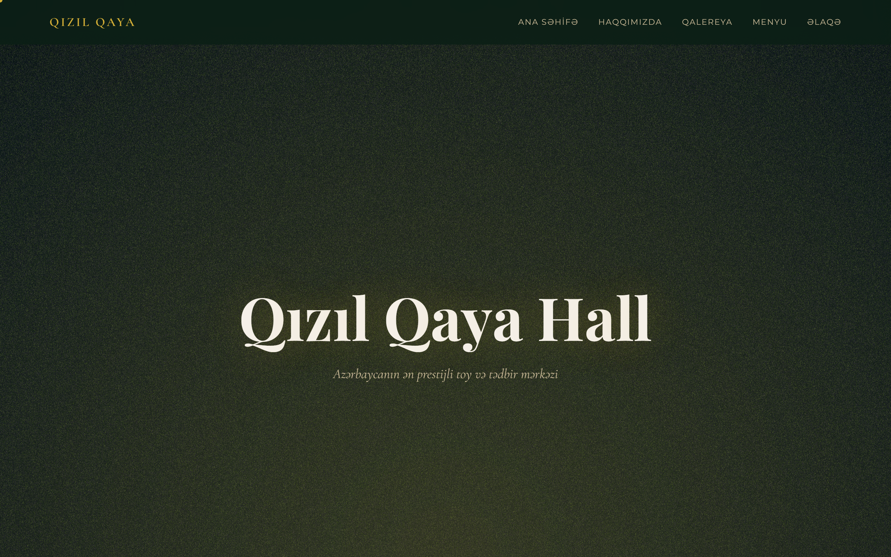
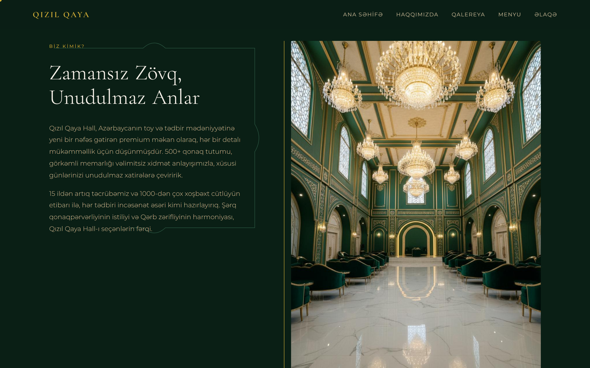
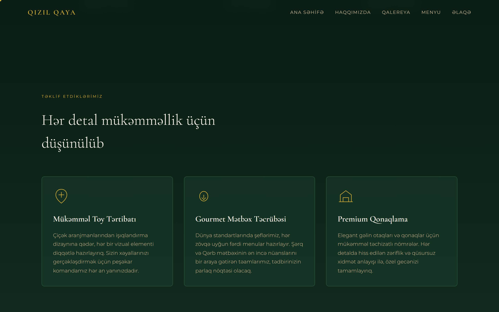
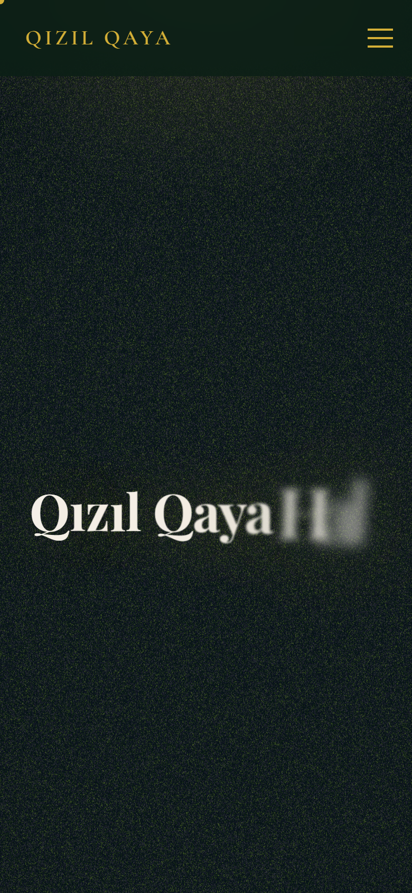

# 👑 Qızıl Qaya Hall — Luxury Wedding & Event Venue Landing Page

<p align="center">
  
  
  
  
  
  
  
</p>

---

## 📸 Preview & Screenshots

### 🖥 Hero Section (Interactive WebGL Fluid & Kinetic Title)


### 🏰 Grand Hall & Venue Atmosphere


### 💎 Premium Services & Banquets


### 📱 Mobile Experience
<p align="center">
  
</p>

---

## 📌 About The Project

A high-end, immersive landing page created for **Qızıl Qaya Hall** — one of Azerbaijan’s most prestigious wedding, banquet, and gala celebration venues.

Built with cutting-edge web technologies, the page delivers a cinematic digital experience blending **WebGL real-time fluid physics**, **GSAP micro-interactions**, **smooth momentum scrolling (Lenis)**, and opulent golden aesthetics (*Cormorant Garamond* & *Playfair Display* typography).

---

## ✨ Key Features

* **🌊 Interactive Three.js Fluid Canvas:** Real-time liquid gold shader reacting to cursor movement on the hero screen.
* **✨ Kinetic Typography & Light Beams:** Dramatic opening animations built with GSAP and custom CSS light rays.
* **📜 Smooth Momentum Scroll:** Integrated **Lenis** scroll engine for an effortless, buttery-smooth browsing experience.
* **🏰 Comprehensive Event Sections:**
  * **Grand Halls:** Detailed breakdown of banquet capacities, royal stages, and acoustical design.
  * **Services:** Dedicated showcases for Weddings (*Toy*), Engagements (*Nişan*), and Corporate Galas.
  * **Menu & Catering:** High-resolution presentation of gourmet national and European cuisine.
  * **Photo Gallery:** Responsive carousel highlighting celebration memories.
* **📱 Pixel-Perfect Responsive Design:** Tailored layouts with fluid typography that shine on everything from smartphones to 4K displays.
* **🖱 Custom Luxury Cursor:** Subtle, interactive cursor follow-effect for desktop visitors.

---

## 🛠 Tech Stack

* **Core Framework:** [React 19](https://react.dev/)
* **Build System:** [Vite 7](https://vitejs.dev/)
* **Language:** [TypeScript](https://www.typescriptlang.org/)
* **3D & Shaders:** [Three.js](https://threejs.org/) (WebGL)
* **Animation & Motion:** [GSAP 3.15](https://greensock.com/gsap/)
* **Smooth Scrolling:** [Lenis](https://lenis.darkroom.engineering/)
* **UI & Styling:** [Tailwind CSS](https://tailwindcss.com/) + [Radix UI](https://www.radix-ui.com/)
* **Carousel Engine:** [Embla Carousel](https://www.embla-carousel.com/)

---

## 🚀 Quickstart

### 1. Clone the repository
```bash
git clone https://github.com/uahadov/qizil-qaya-kimi-k26.git
cd qizil-qaya-kimi-k26
```

### 2. Install dependencies
```bash
npm install
```

### 3. Run development server
```bash
npm run dev
```
Open [http://localhost:5173](http://localhost:5173) in your browser.

### 4. Build for production
```bash
npm run build
```
The optimized build will be generated in the `dist/` folder.

---

## 📁 Project Structure

```text
├── docs/
│   └── screenshots/        # High-resolution desktop & mobile UI screenshots
├── public/
│   └── images/             # Venue photos, gallery pictures, and food assets
├── src/
│   ├── components/
│   │   ├── FluidCanvas.tsx      # Three.js WebGL fluid canvas
│   │   ├── KineticTitle.tsx     # Kinetic typography component
│   │   ├── CustomCursor.tsx     # Interactive custom cursor
│   │   └── ui/                  # Radix UI + Tailwind design components
│   ├── hooks/
│   │   └── useLenis.ts          # Smooth momentum scroll hook
│   ├── pages/
│   │   └── Home.tsx             # Main landing page view
│   ├── sections/                # Modular page sections (Hero, About, Menu, Gallery, Contact)
│   ├── App.tsx                  # Root application router & layout
│   └── main.tsx                 # Entry point
├── package.json
└── vite.config.ts
```

---

## 📄 License

This project is open-source and available under the [MIT License](LICENSE).
